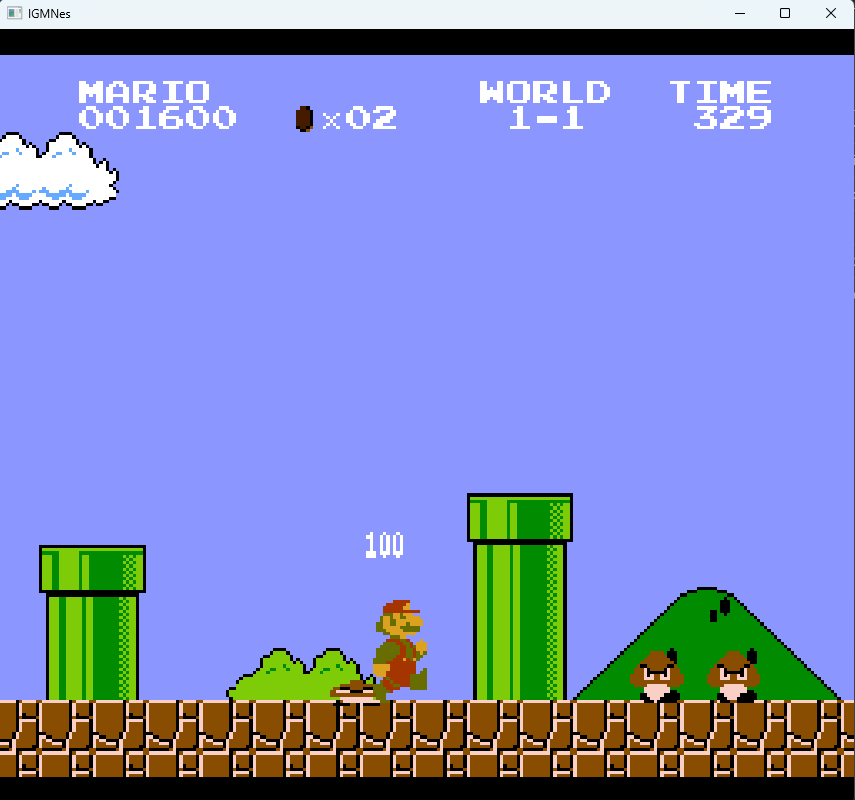
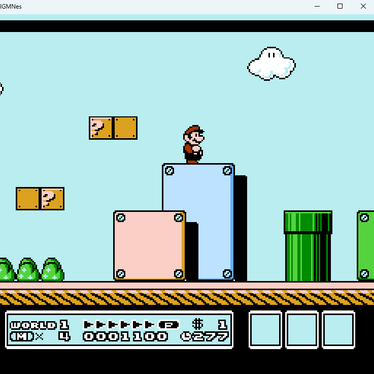
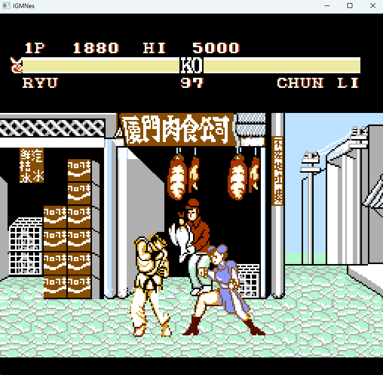

# igmnes
(yet another) NES emulator written in Rust

### Project status:

| Component     | Status                                                            |
| :------------:|:------------------------------------------------------------------|
| CPU           | Fully functional 6502 implementation (barring unofficial opcodes) |     
| APU           | Implemented Pulse, Triangle and Noise channels (no DMC yet)              |
| PPU           | Fully implemented and mostly cycle-accurate                                                   |  
| Input         | Implemented (Player 1 only)                                                   |
| Mappers       | 000 (NROM), 002 (UxROM), 003 (CNROM), 004 (MMC3), 007 (AxROM), 189 (?)                                            |
| Debugger      | Terminal-based CPU debugger                                  |

### Screenshots

